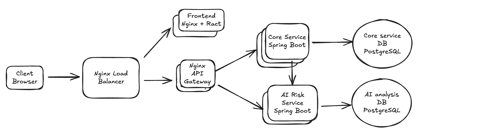

# Swissquote Customer Activity Analytics

A Dockerized customer activity and AI risk-analysis dashboard for financial-services operators.

## How to Run the Application

Docker is required. Install Docker Desktop on [macOS](https://docs.docker.com/desktop/setup/install/mac-install/) or [Windows](https://docs.docker.com/desktop/setup/install/windows-install/), or install [Docker Engine and the Compose plugin on Linux](https://docs.docker.com/engine/install/).

Verify the installation:

```bash
docker --version
docker compose version
```

From the project root, start the complete stack with one command:

```bash
docker compose up --build -d
```

Open the application at <http://localhost:3000>.

The demo starts with mock operator login enabled.

Run the complete local test harness from the project root:

```bash
./scripts/agent-harness.sh
```

It runs backend and AI-service Gradle tests, frontend Vitest tests, and a Docker Compose configuration check. To run only backend tests, use `./gradlew :backend:test :ai-service:test`; to run only frontend tests, use `cd frontend && npm test`.

## Architecture



The stack contains:

- Nginx load balancer as the public entry point on port `3000`.
- Frontend container serving the built React application through Nginx.
- Nginx API gateway routing backend requests.
- Core Spring Boot service for authentication, customer search, activity retrieval, filtering, sorting, and risk signals.
- AI Spring Boot service for policy retrieval, risk analysis, recommendations, and analysis history.
- Separate PostgreSQL databases for core customer data and AI analysis data.

The core service sends a bounded activity and risk snapshot to the AI service. The AI service does not query the core database directly.

The application services can scale horizontally. The current gateway uses sticky sessions for backend replicas because authenticated browser sessions are stored in the core service. Production deployments should use shared or externalized session storage.

## Main Design Decisions

- **Separate containers:** frontend, gateway, core service, AI service, and databases have independent build, deployment, and scaling boundaries.
- **Nginx at the edge:** the load balancer provides the public entry point; the internal API gateway isolates browser routing from backend services.
- **Optional horizontal scaling:** frontend, API gateway, core, and AI services can run as multiple replicas when traffic requires it. The default demo starts one instance of each service.
- **Service-owned data:** the core service owns customers, transactions, activity details, operators, rules, and risk assessments. The AI service owns analysis requests, results, policy evidence, and audit metadata.
- **Separated databases:** transaction and customer reads are isolated from AI-analysis writes and history queries. This prevents AI workloads from competing with the transaction-read workload and allows the transaction source to remain read-only or scale independently through a read replica when it is under heavy load.
- **Liquibase with SQL:** database schema and demo data are synchronized through formatted SQL changelogs under `backend/src/main/resources/db/changelog`.
- **Server-side activity querying:** filtering, sorting, pagination, and lazy loading are performed by the backend. The UI loads 50 rows by default and the server caps a request at 100 rows.
- **Explicit persistence boundaries:** simple customer lookup uses Spring Data JPA; the joined activity report uses a focused SQL adapter for complex queries.
- **AI extension point:** the AI service currently uses a deterministic analyzer and bundled policy documents. Its interface is designed for a later Spring AI model, vector store, and asynchronous worker flow.
- **Risk scoring:** risk analysis uses the average contribution of triggered risk signals and persists the result, recommendations, policy evidence, and generating operator.
- **Security:** CSRF protection, parameterized database access, restricted gateway routing, escaped UI rendering, bounded AI inputs, and environment-only OAuth secrets are used for the demo flow.
- **Demo configuration:** the tracked database password and local mock token are intentionally disposable and must be replaced with managed secrets in any real deployment.

## Assumptions

- **Mocked operators:** authentication uses mock operators for the demo. In a production system, this would be replaced with a dedicated authentication and identity service, including operator provisioning, roles, access policies, and account lifecycle management.
- **Read-only transaction source:** transaction data is assumed to arrive from a PostgreSQL read replica populated by an upstream transaction platform. The demo focuses on searching, filtering, risk analysis, and review, so transaction insertion and ingestion workflows are intentionally not implemented here.
- **Observability:** a production deployment would include observability tooling such as Sentry for error tracking and Prometheus for metrics. These components are omitted from the demo to keep the setup simple.
